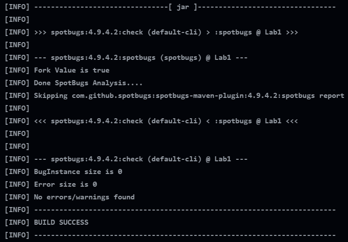
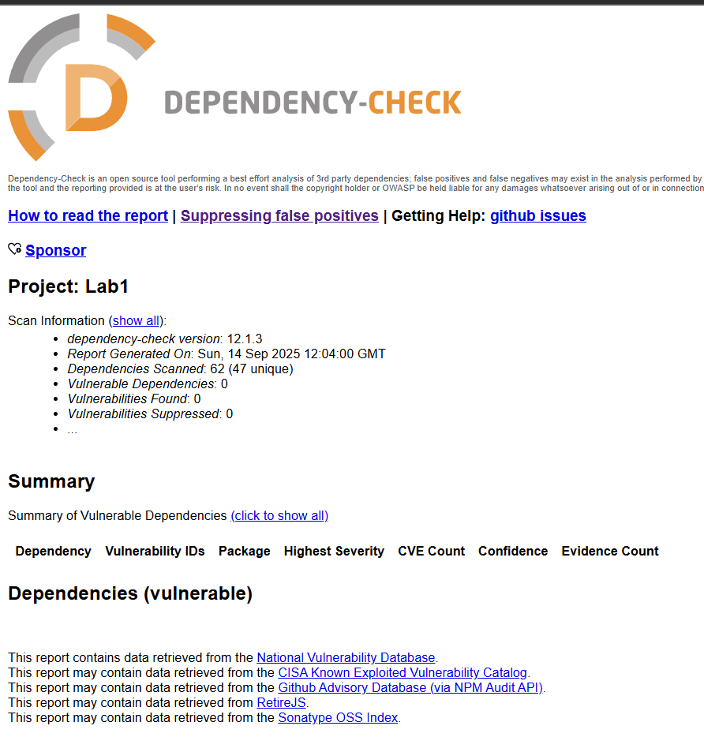

# Работа 1: Разработка защищенного REST API с интеграцией в CI/CD

## Описание проекта и API

Проект предоставляет API для аутентификации пользователей и управления их данными. Реализована регистрация и авторизация с использованием JWT токенов, а также защищенные эндпоинты для работы с пользовательскими данными.

### Базовый URL
`localhost:8080`

### Аутентификация

#### Регистрация нового пользователя
- **Endpoint:** `POST /auth/register`
- **Тип:** Public
- **Тело запроса:**
```json
{
    "username": "string",
    "password": "string"
}
```
- **Описание:** Создает нового пользователя в системе

#### Авторизация пользователя
- **Endpoint:** `POST /auth/login`
- **Тип:** Public
- **Тело запроса:**
```json
{
    "username": "string",
    "password": "string"
}
```
- **Ответ:**
```json
{
    "username": "string",
    "token": "string"
}
```
- **Описание:** Выполняет вход пользователя и возвращает JWT токен для доступа к защищенным эндпоинтам

### Работа с данными (требуют JWT токен)

#### Сохранение данных пользователя
- **Endpoint:** `PUT /api/data`
- **Тип:** Secured (JWT)
- **Заголовки:** `Authorization: Bearer <token>`
- **Тело запроса:** Произвольная строка данных
- **Ответ:** `"Saved"`
- **Описание:** Сохраняет данные для текущего аутентифицированного пользователя

#### Получение данных пользователя
- **Endpoint:** `GET /api/data`
- **Тип:** Secured (JWT)
- **Заголовки:** `Authorization: Bearer <token>`
- **Ответ:**
```json
{
    "data": "string"
}
```
- **Описание:** Возвращает сохраненные данные текущего аутентифицированного пользователя

## Описание реализованных мер защиты

### Защита от SQLi

Для хранения данных пользователей используется ORM Hibernate.
Конкатенация строк для формирования SQL-запросов **не** используется.

### Защита от XSS

Все пользовательские данные, которые возвращаются в ответах API, возвращаются строго в формате JSON через DTO-объекты.
Библиотека Jackson обеспечивает экранирование данных, возвращаемых в JSON-строке.
Для формирования ответа об ошибке на уровне фильтра, сообщение экранируется с помощью `HtmlUtils.htmlEscape()`

### Защита от Broken Authentication

Защищенные эндпоинты требуют наличия JWT-токена в соответствующем заголовке запроса.
На уровне middleware токен парсится и валидируется, и только если он валиден, доступ к эндпоинту предоставляется.
Username пользователя хранится в токене, и не может быть свободно изменен.
Пароли пользователей в БД хранятся в захэшированном с помощью bcrypt-алгоритма виде.

## Отчеты SAST/SCA

### Отчет SAST (Static Application Security Testing)

Для тестирования используется Java SpotBugs с плагином FindSecBugs, который нацелен на поиск ошибок безопасности



### Отчет SCA (Software Composition Analysis)

Для тестируется используется OWASP Dependency-Check


